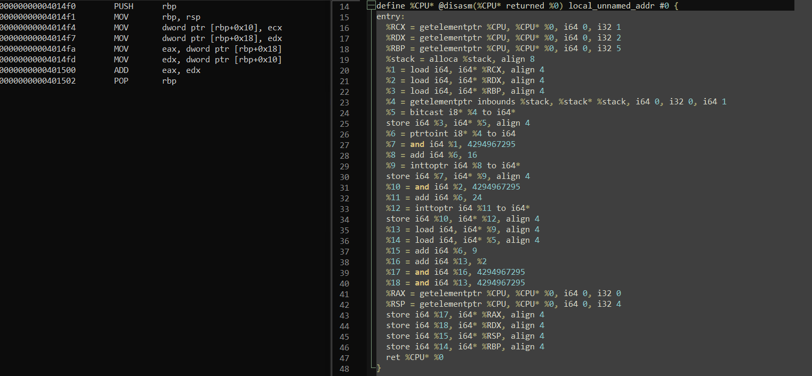
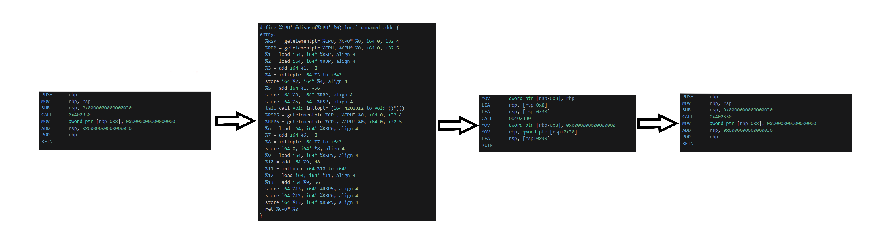

 

  <h1 align="center">Asm2LLVM - Convert machine code to LLVM IR</h1>

## About the project

**Asm2LLVM** is a library for convert x86-64 machine code to LLVM IR. 
The LLVM IR can be optimized and compiled again for the x86_64 target and executed with better performance. 
The LLVM IR contains the virtual CPU registers.

## Available functions

- Converting x86-64 machine code to LLVM IR using bddisasm
- LLVM IR to x86_64 using AsmJit
- x64dbg plugin

## Build

Here is the step to set up the environment to build this tool:
1. Download and install [Visual Studio](https://visualstudio.microsoft.com/pl/)
2. Download and install [QT Plugin](https://download.qt.io/development_releases/vsaddin/2.8.0/qt-vsaddin-msvc2022-2.8.0.vsix)
3. Download and install [Qt 5](https://download.qt.io/archive/qt/5.12/5.12.12/qt-opensource-windows-x86-5.12.12.exe)
4. Download and install [vcpkg](https://github.com/microsoft/vcpkg) and install these packages: 
`vcpkg install asmjit:x64-windows` 
`vcpkg install llvm[clang,compiler-rt,core,default-targets,enable-bindings,enable-terminfo,enable-zlib,enable-zstd,lld,target-spirv,target-x86,tools]:x64-windows` 

## Example of conversion

## Process of optimization

## Plugin test
